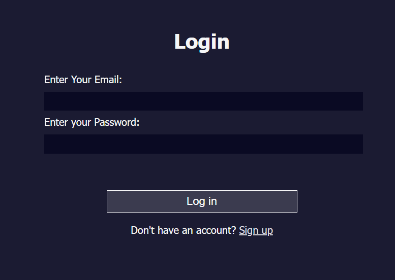
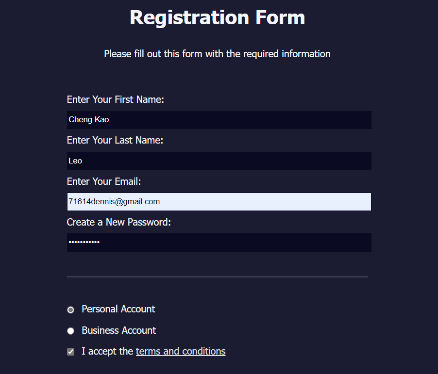
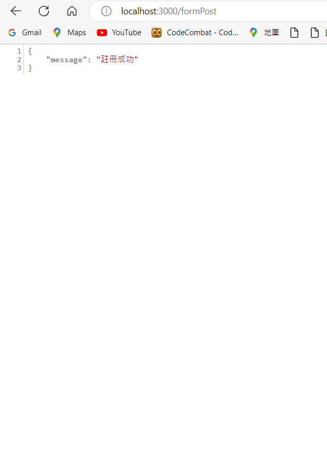
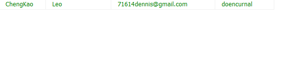

# Simple Registration System
<h2></h2>
<h2></h2>
<h2></h2>
<h2></h2>
<h2></h2>

## Description
這是一個簡單的登入註冊系統，旨在讓使用者註冊並登入的應用程式。這個系統由以下主要組件組成：
* index.html：這個HTML文件用於顯示登入和註冊表單。使用者可以在這裡輸入他們的登入資訊或註冊新帳戶。
* regis.html：這個HTML文件包含註冊表單，允許使用者提供新帳戶的資訊，並將其儲存在資料庫中。
* Node.js應用程式：這個後端應用程式使用Node.js編寫，它負責處理前端傳遞的請求，連接到資料庫並執行必要的操作，例如註冊新帳戶或驗證使用者的登入。

## Requirements
* 前端: HTML、CSS、JavaScript
* 後端: Node.js、MySQL

## How to use
1. 下載或clone這個儲存庫到你的本地機器。
2. 在你的終端中切換到專案的目錄。
3. 安裝所需的Node.js模組，你可以使用以下命令：
``` npm install ```
4. 啟動Node.js應用程式，你可以使用以下命令：
``` node server.js ```，這將啟動後端應用程式，它將在指定的端口上監聽請求。
5. 在瀏覽器中打開index.html文件，開始使用登入和註冊功能。
